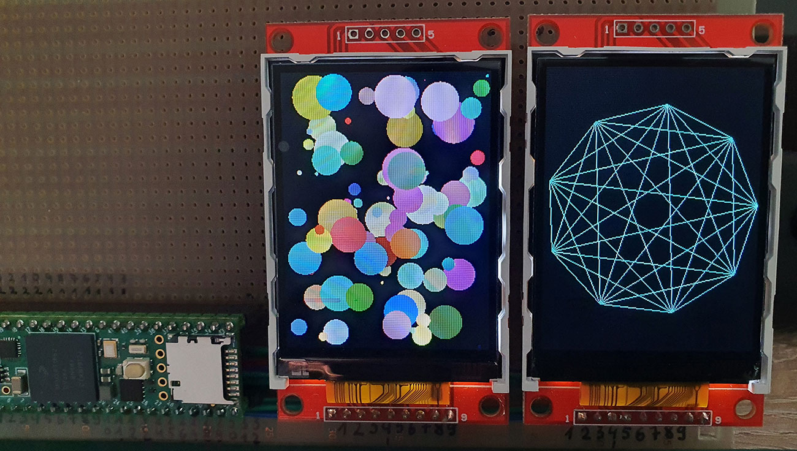

DualDisplay_T4
======
**With this example two displays with ILI9341 controller (320x240px) can be connected to a Teensy 4.x.**
Copyright (C) 2021 by DIYLAB <https://www.diylab.de>

By using the library [ILI9341_T4](https://github.com/vindar/ILI9341_T4), you can draw very fast even with low SPI clock. In the example the clock is 30MHz. Depending on the display up to 70MHz are possible.
Framebuffer, differential buffer and a vertical synchronization are available to you. The result is completely flicker-free at 100FPS.
The example includes some simple functions for primitive drawing. You can of course use any graphics library that supports a framebuffer directly. I recommend Arvind's TGX library: https://github.com/vindar/tgx 

### Watch the video

### Test setup

### These components are required as a minimum

* Teensy 4.0 or Teensy 4.1
* Two TFT displays with ILI9341 controller and a resolution of 320x240 px

[3.2inch SPI Module ILI9341 SKU:MSP3218](http://www.lcdwiki.com/3.2inch_SPI_Module_ILI9341_SKU:MSP3218)

[2.8inch SPI Module ILI9341 SKU:MSP2807](http://www.lcdwiki.com/2.8inch_SPI_Module_ILI9341_SKU:MSP2807)

[2.4inch SPI Module ILI9341 SKU:MSP2402](http://www.lcdwiki.com/2.4inch_SPI_Module_ILI9341_SKU:MSP2402)

Many other displays are also possible if they have the required connectors, have the ILI9341 controller and a resolution of 320x240 px.

### Displays connection diagram

| Display 1      | Teensy                                                       |
| -------------- | ------------------------------------------------------------ |
| VCC            | **3.3V** (from Teensy, better 3.3V from separate LDO) ¹      |
| GND            | **GND** (on top, between Vin and 3.3V)                       |
| CS             | **9**                                                        |
| RESET          | **6**                                                        |
| DC/RS          | **10**                                                       |
| SDI (**MOSI**) | **11**                                                       |
| SCK            | **13**                                                       |
| LED            | any available pin will do or connect to +3.3V through a small resistor 50 to 100 Ohm |
| SDO (**MISO**) | **12**                                                       |

| Display 2      | Teensy                                                       |
| -------------- | ------------------------------------------------------------ |
| VCC            | **3.3V** (from Teensy, better 3.3V from separate LDO) ¹      |
| GND            | **GND** (on top, between Vin and 3.3V)                       |
| CS             | **30**                                                       |
| RESET          | **29**                                                       |
| DC/RS          | **0**                                                        |
| SDI (**MOSI**) | **26**                                                       |
| SCK            | **27**                                                       |
| LED            | any available pin will do or connect to +3.3V through a small resistor 50 to 100 Ohm |
| SDO (**MISO**) | **1**                                                        |

¹ Recommended: close the jumper **J1** on the display.

### Used libraries

1. Arvind's optimized ILI9341 screen driver library for Teensy 4/4.1, with vsync and differential updates: <https://github.com/vindar/ILI9341_T4>

### Used development software

* Arduino IDE 1.8.15 (always needed)
* Teensyduino, Version 1.54 (always needed, versions below 1.54 will not work)
* [optional: Microsoft Visual Studio Community 2019 + Visual Micro - Release 21.06.06.17]